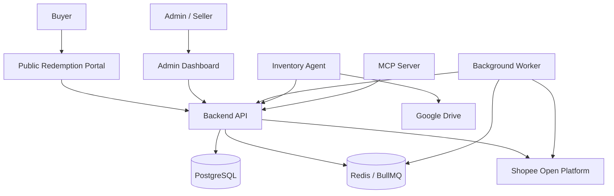

## System architecture

The Shopee Auto Redeemer v2 platform is composed of six cooperating services: a Bun/Express backend, a React admin dashboard, a React public redemption portal, a Redis/BullMQ background worker, an optional Google Drive inventory agent, and an optional MCP server. Each service has a focused responsibility and communicates through the backend API or shared infrastructure.

## Backend API

The backend is a Bun-powered TypeScript application using Express 5. It serves as the central API for all operations: authentication, seller and shop management, product synchronization, redemption URL configuration, and public buyer redemption lookup. It connects to PostgreSQL for persistent data and Redis for job queuing via BullMQ. Swagger/OpenAPI documentation is served at `/api/docs`.

Key responsibilities include:

- JWT authentication and role-based access for `ADMIN` and `SELLER`
- Shopee OAuth and token lifecycle management
- Product and model synchronization from Shopee
- Redemption URL configuration at product and model levels
- Public order redemption lookup with rate limiting
- Product boosting through the Shopee API
- BullMQ job submission for asynchronous synchronization and token refresh

## Admin Dashboard

The admin dashboard is a React 19 and Vite application for sellers and administrators. It provides a management interface for sellers, shops, products, and redemption URLs. The application uses Tailwind CSS, Radix UI, React Router 7, and TanStack Table.

Key features include:

- Seller management: create, update, and delete sellers
- Shop management with Shopee credential configuration
- Product listing with synchronization controls
- Product-level and model-level redemption URL editing
- Shopee token health display
- Product boosting and round-robin boost controls

## Public Redemption Portal

The public redemption portal is a React 19 and Vite application that buyers interact with. Buyers enter a Shopee order ID and receive matching redemption links. When a product model has multiple active URLs, the portal displays a redemption directory at `/r/:directory_key`.

Key features include:

- Order ID submission to `POST /api/redemption`
- Display of matching redemption URLs
- Warning display for unconfigured items with the `CONTACT_SELLER_REQUIRED` status
- Multi-link redemption directories at `/r/:directory_key`

## Background Worker

The background worker is a separate process that runs BullMQ jobs from Redis. It handles token refresh and product synchronization outside the request flow.

<Callout kind="info">

The worker runs three job types: `scan-due-shops`, which runs every five minutes, `refresh-shop-token`, and `product-sync`. Enable the worker by setting `TOKEN_REFRESH_WORKER=true` in the backend environment.

</Callout>

## Inventory Agent

The Inventory Agent is an optional Bun and TypeScript service that matches products lacking redemption URLs with files in Google Drive. It indexes Drive metadata, compares names and SKUs, optionally uses OpenRouter for semantic matching, and submits safe assignments to the backend. The agent stores its local state in SQLite.

The matching priority is:

1. Previously approved matches
2. Exact SKU matches
3. Exact name matches
4. Optional OpenRouter semantic matching

## MCP Server

The MCP server is an optional Model Context Protocol adapter that wraps the backend API. It supports stdio and authenticated HTTP transport. The server is limited to one configured seller and shop, and exposes tools for product listing, redemption URL management, and synchronization control.

Available MCP tools include:

- `list_products`, `get_product`
- `list_redemption_targets`, `set_product_redemption_link`, `set_variant_redemption_links`, `assign_missing_redemption_links`
- `sync_products`, `get_sync_status`, `get_token_health`

## Data flow

The end-to-end redemption flow connects the administrative interfaces, background services, backend API, data stores, and Shopee Open Platform:

1. An administrator creates a seller and shop with Shopee credentials.
2. The seller authorizes the shop through Shopee OAuth.
3. The seller triggers product synchronization. A BullMQ job fetches products from Shopee and stores them in PostgreSQL.
4. The seller assigns redemption URLs to products or models.
5. A buyer enters an order ID on the public redemption portal.
6. The backend validates the order through the Shopee API, resolves redemption URLs, and returns the links.
7. If enabled, the Inventory Agent fills missing URLs from Google Drive.

## Technology stack

| Component | Technology |
|---|---|
| Backend | Bun, TypeScript, Express 5, PostgreSQL 17, Redis 7, BullMQ |
| Admin Dashboard | React 19, Vite, Tailwind CSS, Radix UI, React Router 7, TanStack Table |
| Public Portal | React 19, Vite, TypeScript |
| Inventory Agent | Bun, Google Drive API, SQLite, OpenRouter optional |
| MCP Server | MCP SDK, Bun, TypeScript |
| Infrastructure | Docker Compose |