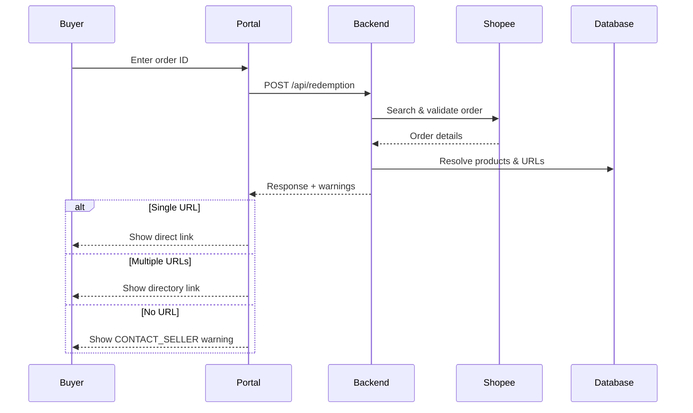

## Buyer redemption

The public redemption portal is the buyer-facing entry point. Enter a Shopee order ID to have the backend validate the order through Shopee, resolve redemption URLs, and return the results. No account or login is required.

## Submitting an order ID

The public portal accepts a Shopee order ID and submits it to the backend:

<Request>

```bash
curl -X POST http://localhost:8080/api/redemption \
  -H "Content-Type: application/json" \
  -d '{"order_id": "240101ABCDEF123"}'
```

</Request>

This endpoint is public. No authentication is required.

## Response format

A successful response contains a `response` array with redemption entries and a `warnings` array:

<Response>

```json
{
  "response": [
    {
      "shopee_item_id": 123,
      "item_name": "Windows Pro License",
      "shopee_model_id": 456,
      "model_name": "Windows",
      "quantity": 1,
      "redeem_url": "https://redeem.acme.test/windows"
    }
  ],
  "warnings": []
}
```

</Response>

Each redemption entry represents an order line matched to a product or model configured by the seller.

## How the backend resolves orders

The backend processes the order through these steps:

1. Applies an in-memory rate limit of 20 attempts per IP per minute.
2. Validates the order ID format with Zod.
3. Searches connected shops through Shopee to find the order.
4. Retrieves full order details from Shopee.
5. Rejects orders that are missing or non-redeemable.
6. Checks the order status against the allowed list.
7. Aggregates duplicate order lines and quantities.
8. Looks up local products by Shopee item ID.
9. Looks up local models by Shopee model ID.
10. Resolves the redemption URL using the priority chain.
11. Returns redemption entries and warnings.

## Allowed order statuses

Only orders in the following statuses are eligible for redemption:

| Status | Description |
|---|---|
| `READY_TO_SHIP` | Order is ready for shipping |
| `PROCESSED` | Order has been processed |
| `RETRY_SHIP` | Shipping retry pending |
| `SHIPPED` | Order has been shipped |
| `TO_CONFIRM_RECEIVE` | Awaiting buyer confirmation |
| `COMPLETED` | Order is fully completed |

## Rate limiting

The redemption endpoint enforces an in-memory rate limit of 20 requests per IP address per minute. If you exceed this limit, the endpoint returns a rate limit error. Wait before submitting another request.

<Callout kind="info">

The rate limit is in-memory and resets when the backend restarts. It protects the Shopee API from abuse without requiring buyer accounts.

</Callout>

## Multi-link redemption directories

When a product model has multiple active redemption URLs, the response contains a directory URL instead of a direct link. The directory URL follows this format:

```text
https://your-portal-host/r/:directory_key
```

Open the directory URL in the public portal to view all active redemption links for the model in the configured order.

The directory data is also available through the API:

```bash
curl "http://localhost:8080/api/redemption/directories/:directory_key"
```

A model with one active URL returns that URL directly. If the model has no configured URL, the backend falls back to the product-level URL when one exists.

## Warnings

The `warnings` array reports issues that did not prevent the response but require attention. The most common warning is:

| Warning | Cause | Action |
|---|---|---|
| `CONTACT_SELLER_REQUIRED` | No redemption URL is configured for the purchased item | Ask the seller to assign a redemption URL to the product or model |

A warning can appear alongside successful redemption entries when only some order lines are configured.

## Public portal UI

The public portal renders the redemption flow for buyers:

- Order ID input field and submit button
- Redemption link display for each order line
- Directory link display for multi-URL models
- Warning messages for unconfigured items
- Error messages for invalid or rate-limited requests



<Callout kind="tip">

Sellers can configure product and model redemption links in [Redemption URLs](/redemption-urls). For common buyer issues, see [Troubleshooting](/troubleshooting).

</Callout>