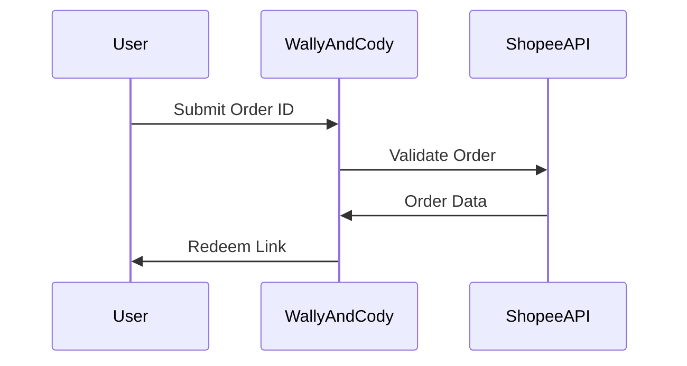

## Core Features

Wally And Cody delivers essential DevOps capabilities tailored for Shopee order redeem automation. You get instant access to redeem links without manual intervention.

<Columns cols={2}>
  <Card title="Instant Delivery" icon="zap" href="/features/instant-delivery">
    Receive redeem links in seconds after entering your Shopee order ID.
  </Card>
  <Card title="Auto Redeem System" icon="settings" href="/features/auto-redeem">
    Automated processing handles validation and link generation seamlessly.
  </Card>
  <Card title="One-Tap Interface" icon="mouse-pointer" href="/features/interface">
    Simple input field and button for effortless redeem link retrieval.
  </Card>
  <Card title="Shopee Order Support" icon="package" href="/features/supported-orders">
    Compatible with vouchers, coins, and promotional orders from Shopee.
  </Card>
</Columns>

## Instant Delivery Mechanism

The instant delivery feature processes your Shopee order ID immediately upon submission. You enter the ID, and the system fetches the redeem link without delays.

<Steps>
  <Step title="Enter Order ID" icon="hash">
    Input your Shopee order ID from the app or website.
  </Step>
  <Step title="Validate Order" icon="check-circle">
    System checks order status and eligibility automatically.
  </Step>
  <Step title="Generate Link" icon="link">
    Retrieve and display the redeem link instantly.
  </Step>
</Steps>

<Callout kind="success">
  Delivery typically completes in `<1s`, ensuring a smooth user experience.
</Callout>

## Auto Redeem System Explained

The auto redeem system integrates with Shopee APIs to handle the entire flow programmatically. You can embed it in your DevOps pipelines for bulk processing.



For API integration, use the following endpoint:

<Request tabs="cURL,JavaScript">
  ```bash
  curl -X POST https://api.example.com/v1/redeem \
    -H "Authorization: Bearer YOUR_API_KEY" \
    -H "Content-Type: application/json" \
    -d '{"orderId": "1234567890"}'
  ```
  ```javascript
  const response = await fetch('https://api.example.com/v1/redeem', {
    method: 'POST',
    headers: {
      'Authorization': 'Bearer YOUR_API_KEY',
      'Content-Type': 'application/json',
    },
    body: JSON.stringify({ orderId: '1234567890' })
  });
  const data = await response.json();
  ```
</Request>

<Response tabs="200">
  ```json
  {
    "success": true,
    "redeemLink": "https://shopee.com/redeem/abc123",
    "orderId": "1234567890"
  }
  ```
</Response>

## Simple One-Tap Interface

Access the one-tap interface via web or mobile. It requires only your order ID—no accounts or extra steps.

<Tabs>
  <Tab title="Web" icon="globe">
    Visit `https://dashboard.example.com/redeem` and paste your order ID.
  </Tab>
  <Tab title="Mobile" icon="smartphone">
    Use the app: scan QR or enter ID directly for instant results.
  </Tab>
</Tabs>

## Supported Shopee Order Types

Wally And Cody supports various Shopee order formats. Review compatibility below:

| Order Type     | Description                          | Supported |
|----------------|--------------------------------------|-----------|
| Voucher        | Promotional vouchers                 | Yes      |
| Shopee Coins   | Coin redemptions                     | Yes      |
| Product Deals  | Flash sale rewards                   | Yes      |
| Standard Promo | General promotional codes            | Yes      |

<Expandable title="Advanced Configuration" default-open="false">
  Customize support via environment variables in your DevOps setup:

  ```bash
  export SHOPEE_ORDER_TYPES="voucher,coins,deals"
  ```
</Expandable>

<Callout kind="tip">
  Test with sample order IDs like `1234567890` in sandbox mode first.
</Callout>