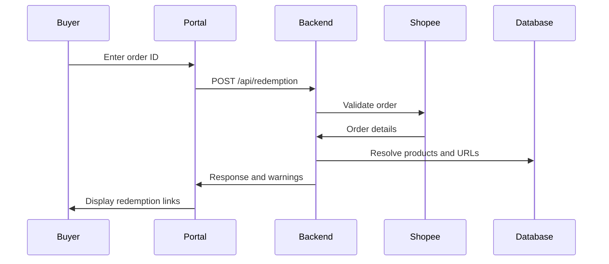

## Automate product redemption from sync to delivery

The platform provides a complete toolkit for Shopee sellers to automate product redemption. From automatic token refresh to multi-URL redemption directories, every capability is designed to reduce manual work and speed up delivery to buyers.

<Columns cols={2}>
  <Card title="Automated Product Sync" icon="refresh-cw" href="/product-sync">
    Pull products, variants, prices, and stock from Shopee into PostgreSQL with incremental or full sync modes.
  </Card>
  <Card title="Multi-Level Redemption URLs" icon="link" href="/redemption-urls">
    Configure URLs at the product or model level, with support for multiple labeled links per model.
  </Card>
  <Card title="Token Auto-Refresh" icon="key" href="/token-refresh">
    A background worker refreshes Shopee access tokens automatically before they expire.
  </Card>
  <Card title="Product Boosting" icon="trending-up" href="/product-boosting">
    Enable products for boosting and run round-robin campaigns through the Shopee API.
  </Card>
  <Card title="Public Redemption Portal" icon="shopping-bag" href="/buyer-redemption">
    Buyers enter a Shopee order ID and receive matching redemption links instantly.
  </Card>
  <Card title="Inventory Agent" icon="bot" href="/inventory-agent">
    Automatically match Google Drive files to products that lack redemption URLs.
  </Card>
  <Card title="MCP Server" icon="code" href="/mcp-server">
    Access platform capabilities programmatically through Model Context Protocol automation tools.
  </Card>
  <Card title="Role-Based Access" icon="shield" href="/authentication">
    Protect platform access with JWT authentication and ADMIN or SELLER roles.
  </Card>
</Columns>

## Automated product synchronization

Product sync pulls item data from the Shopee Open Platform into PostgreSQL. The backend submits a BullMQ job to Redis, and the background worker fetches and upserts products, models, prices, stock, and raw metadata. Sync runs in two modes:

| Mode | Description |
|---|---|
| Full | Fetches and upserts all products from the shop. Use for initial sync. |
| Incremental | Fetches only changed products since the last sync. Use for routine updates. |

## Multi-level redemption URLs

Redemption URLs can be configured at two levels. Product-level URLs apply to the entire product. Model-level URLs apply to specific variants and support multiple labeled, ordered, active or inactive links. When a model has multiple active URLs, the backend generates a public redemption directory at `/r/:directory_key`.

URL resolution follows this priority:

1. Multiple active model links: public redemption directory.
2. Single active model link: that direct URL.
3. No model link: product-level URL.
4. No URL configured: `CONTACT_SELLER_REQUIRED` warning.

## Token auto-refresh

Shopee access tokens expire periodically. The background worker runs a scan every five minutes to find shops with expiring tokens and enqueues refresh jobs. This keeps shops authorized without manual intervention.

<Callout kind="info">

Token refresh is handled by the `scan-due-shops` job type. Worker concurrency is controlled by `TOKEN_REFRESH_WORKER_CONCURRENCY`.

</Callout>

## Product boosting

Sellers can mark products for boosting and trigger round-robin campaigns. The backend calls the Shopee boost API for selected products, cycling through them to maximize visibility.

## Buyer redemption flow

The public portal is the buyer-facing entry point. Buyers submit a Shopee order ID, and the backend validates the order through Shopee, checks the order status against an allowlist, aggregates duplicate lines, resolves redemption URLs, and returns the results.

Allowed order statuses: `READY_TO_SHIP`, `PROCESSED`, `RETRY_SHIP`, `SHIPPED`, `TO_CONFIRM_RECEIVE`, `COMPLETED`.

<Callout kind="tip">

Start with the [quickstart](/quickstart), then review the [API reference](/api-reference) for endpoint details.

</Callout>