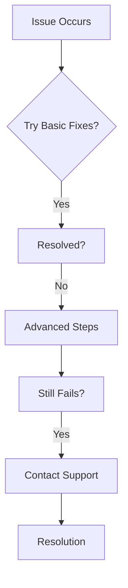

## Common Issues Overview

Encountering problems with Wally And Cody? Most issues stem from order details, network conditions, or rate limits. Start by verifying your Shopee order ID format and checking your internet connection. Use the sections below for targeted fixes.

<Callout kind="info">
  Before diving in, clear your browser cache and try a different device. This resolves 80% of temporary glitches.
</Callout>

## Error Codes Reference

Refer to this table for quick lookup of error messages and initial actions.

| Error Code       | Message                          | Likely Cause                  | First Fix                     |
|------------------|----------------------------------|-------------------------------|-------------------------------|
| `ERR_INVALID_ID` | Invalid or malformed order ID   | Wrong format or typos        | Double-check Shopee order ID |
| `ERR_EXPIRED`    | Order ID expired                | Voucher past redemption date | Use a recent order           |
| `ERR_RATE_LIMIT` | Too many requests               | Exceeded daily limits        | Wait 15 minutes              |
| `ERR_NETWORK`    | Connection timeout              | Unstable internet            | Switch networks              |
| `ERR_FAILED`     | Link generation failed          | Server-side issue            | Retry after 5 minutes        |

## Invalid or Expired Order ID Errors

Shopee order IDs must be active and in the correct format (e.g., 12-digit number starting with 23xxxxxxxxxx).

<Steps>
  <Step title="Verify Order ID" icon="search">
    Log into Shopee. Go to "My Purchases" and copy the exact order ID. Ensure no extra spaces.
  </Step>
  <Step title="Check Expiry" icon="calendar">
    Confirm the order date is within the last 30 days. Expired orders cannot generate redeem links.
  </Step>
  <Step title="Test Format" icon="code">
````javascript
// Valid example
const orderId = "231234567890"; // 12 digits, starts with 23

if (orderId.length === 12 && orderId.startsWith("23")) {
  // Proceed
}
````
  </Step>
  <Step title="Retry Submission" icon="refresh-cw">
    Paste into Wally And Cody and tap "Get redeem link".
  </Step>
</Steps>

<Callout kind="tip">
  Copy-paste directly from Shopee to avoid typos. Manual entry often introduces errors.
</Callout>

## Failed Link Generation Solutions

Failures can occur due to multiple reasons. Use these tabs to match your symptoms.

<Tabs>
  <Tab title="Server Busy" icon="server">
    High traffic causes temporary overloads.
    
    <Steps>
      <Step title="Wait and Retry">
        Pause for 5-10 minutes, then try again.
      </Step>
      <Step title="Use Incognito">
        Open an incognito window to bypass cache issues.
      </Step>
    </Steps>
  </Tab>
  <Tab title="Voucher Unavailable" icon="ticket">
    The linked voucher is out of stock or redeemed.
    
    <Expandable title="Advanced Check" default-open="false">
      Visit the product page on Shopee. Look for "Voucher redeemed" or "Sold out" badges.
    </Expandable>
  </Tab>
  <Tab title="Account Restrictions" icon="shield">
    Your Shopee account may have limits.
    
    ```bash
    # Check Shopee account status via app
    # Navigate to Account > Security > Restrictions
    ```
  </Tab>
</Tabs>

## Network and Rate Limit Issues

<Columns cols={2}>
  <Card title="Rate Limits" icon="clock" href="#">
    You hit the daily cap (50 requests). Reset occurs at midnight UTC.
  </Card>
  <Card title="Network Fixes" icon="wifi-off" href="#">
    Test speed at speedtest.net. Use mobile data as backup.
  </Card>
</Columns>

For rate limits:

````bash
# Wait indicator (conceptual)
echo "Rate limited. Retry in 15m..."
sleep 900
# Submit again
````

<Expandable title="VPN Troubleshooting" default-open="false">
  VPNs can trigger blocks. Disable temporarily:
  
  1. Turn off VPN.
  2. Clear DNS cache: `ipconfig /flushdns` (Windows) or `sudo dscacheutil -flushcache` (macOS).
  3. Retry.
</Expandable>

## When to Contact Support

If basic fixes fail:

<Board title="Support Flow">
  <BoardColumn title="Self-Solve" color="0" icon="lightbulb">
    <BoardCard title="Check FAQ" description="Review docs first" icon="book-open" />
    <BoardCard title="Retry Later" description="Most issues auto-resolve" />
  </BoardColumn>
  <BoardColumn title="Contact Us" color="2" icon="mail">
    <BoardCard title="Email Support" description="support@wallyandcody.com with order ID and screenshot" dueDate="24h" />
    <BoardCard title="Live Chat" description="Available 9AM-6PM UTC" icon="message-circle" />
  </BoardColumn>
</Board>

Provide your order ID, error code, browser, and timestamp for fastest resolution.



<Callout kind="alert">
  Avoid sharing sensitive info like passwords. Screenshots of errors suffice.
</Callout>